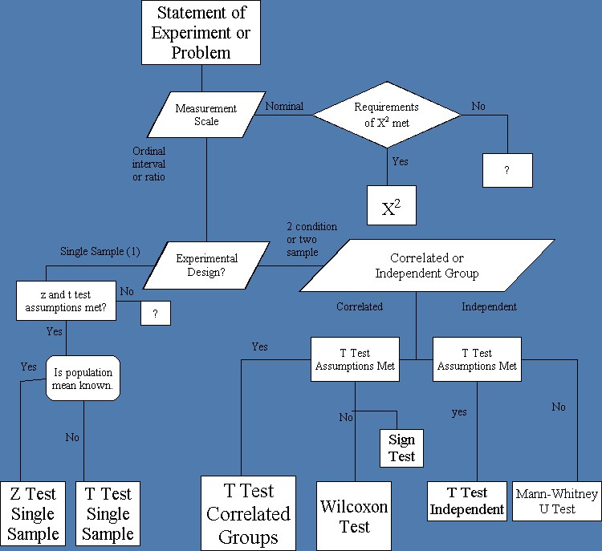
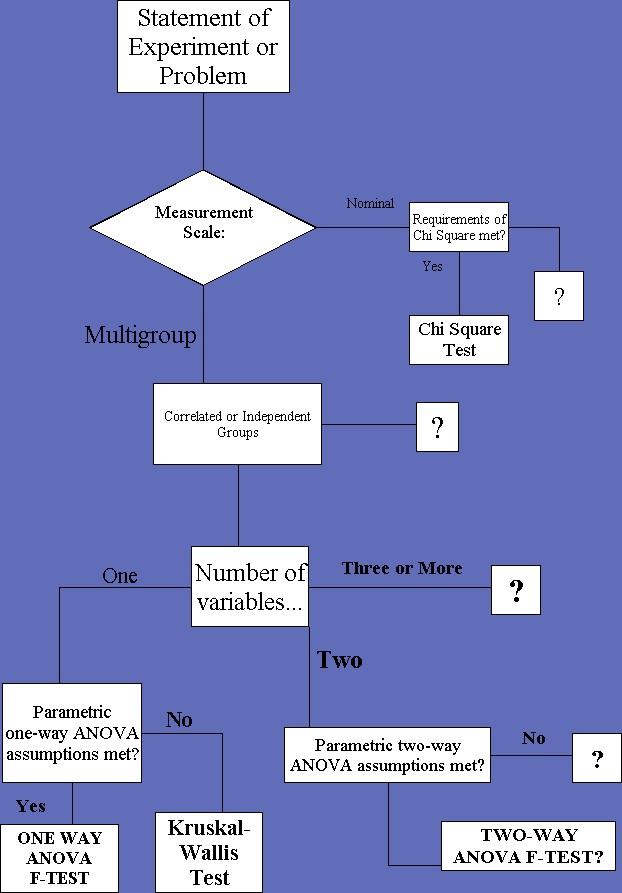

## Topics of Interest

1. Review
2. Confidence
3. Correlation and Regression: Chapter 13 
4. Regression: Chapter 14

--- .class #id 

## Review: Evaluating a situation

The process of making inferences from statistics is often a challenging one. The following steps are used to present data to an audience. 

Step 1: Evaluate the question then select the test that is appropriate based on the context of the question.  
  
Step 2: Write the null ($H_0$) and alternative ($H_a1$) hypotheses for evaluation.

Step 3: Evaluate the critical level for testing the test statistic. This is based on the pre-defined level of $\alpha$.

Step 4: Calculate the appropriate statistic (z, t, etc.).  

Step 5: Compare the calculated statistic with the critical (significant value).

Step 6: Write your decision using the decision rule that is specific for a test statistic that you calculated in step 4.

---

---

---

## Review: Hypotheses

### Non-Parametric hypotheses

* Description: There is no previous knowledge about the population or the population parameters, however, you still need to test hypotheses. Sometimes known as "distribution free tests."
* Useful for testing if group means or medians are distributed the same across groups. 
* Usually used when we do not know if the data follows a "normal distribution."
* Hypotheses:
     * Single Sample or more
     * Can be directional or non-directional based on statistical test restrictions
          * Null ($H_0$): Population = 0
          * Alt  ($H_1$): Population $\neq$ 0

### Examples of test statistics

* Chi-Square, Mann-Whitney, rank-sum test, Kruskal-Wallis test

---

## Review: Hypotheses

### Parametric hypotheses

*Description: The information about the population is completely known by means of the parameters.
* Hypotheses can be directional, non-directional, and can be used for one group or more (depending on the test statistic selected). 
* Single Directional (one-tail):
     * $H_0: \bar{x} = \mu$ and $H_1: \bar{x} > or < \mu$ 
* Single Non-Directional (two-tail):
     * $H_0: \bar{x} = \mu$ and $H_1: \bar{x} \neq \mu$
* Multi Directional (one-tail):
     * $H_0: \bar{x_1} = \bar{x_2} =...\bar{x_n}$
     * $H_1: \bar{x_1} > \bar{x_2} >...> \bar{x_n}$, etc.
* Multi Non-Directional (two-tail):
     * $H_0: \bar{x_1} = \bar{x_2} =...\bar{x_n}$
     * $H_1: \bar{x_1} \neq \bar{x_2} \neq...\neq \bar{x_n}$

### Examples of test-statistics

* z-test, t-test, f-test, ANOVA, regression

---

## Review: Parametric Statistics

### z-test single sample

Distribution must be normal and the population standard deviation is known. This is more powerful compared to the t-test single sample. This test is only used when *THE POPULATION STANDARD DEVIATION* is known.

### t-test single sample

Distribution must be normal, however, the standard deviation for the population is unknown. This is used in place of the "z-test" for single samples when the population standard deviation is *NOT KNOWN*.

### t-test dependent/matched samples

Requires the same assumptions for the t-test single sample. Data must be matched in pairs. 

### t-test independent

Requires the same assumptions for the t-test single sample. Data is NOT matched.

### ANOVA

Compares sample means that can be used to compare more than two means. ANOVA is a robust test, meaning that even when underlying assumptions are violated, the test is still accurate. Assumption: equal population variances. 

### Upcoming: Confidence Intervals, Correlation and Regression

---

## Review: Alpha levels

* $\alpha=.10$: Extremely lenient and rarely used alpha level
* $\alpha=.05$: Frequently used lenient alpha level
* $\alpha=.01$: Frequently used restrictive alpha level
* $\alpha=.001$: Rarely used because it is the MOST restrictive alpha level

---

## Review: Types of errors

* Alpha (Type I Error): An error made in deciding to reject the null hypothesis when the null hypothesis is TRUE.
* Beta (Type II Error): An error made in deciding to retain the null hypothesis when the null hypothesis is FALSE.

Decision     | $\; \; H_0$ is True      | $\; \; H_0$ is False
-------------|--------------------------|----------------
Retain $H_0$ |$\;$ **Correct** Decision | $\;$ Type II Error $\beta$
Reject $H_0$ |$\;$ Type I Error $\alpha$| $\;$ **POWER**

---

## Revisiting Confidence: 

### Conceptual

Recall from Chapter 8 that we are talking about interval estimation and confidence intervals. The level of confidence is 1-alpha.

* **Interval Estimation**: An interval of scores that is established, within which a population's mean (or another parameter) is likely to fall, when that parameter is being estimated from sample data.

* **Confidence Interval (for means and proportions)**: An estimated interval within which we are "confident" -based on sampling theory- that the parameter we are are trying to estimate will fall.

---

## Revisiting Interval Estimation 

### $z$: large samples

Confidence Level | z             | Confidence Level | z
-----------------|---------------|------------------|---
0.70             |$\;$ 1.04      | $\;$ 0.92        | $\;$ 1.75
0.75             |$\;$ 1.15      | $\;$ **0.95**    | $\;$ **1.96**
0.80             |$\;$ 1.28      | $\;$ 0.96        | $\;$ 2.05
0.85             |$\;$ 1.44      | $\;$ **0.98**    | $\;$ **2.33** 
**0.90**         |$\;$ **1.645** | $\;$ **0.99**    | $\;$ **2.58**

### 95% Interval Estimation 

* $\bar{x} \pm z_{\frac{\alpha}{2}}*\sigma_{\bar{x}}$
* $\bar{x} \pm 1.96(\frac{\sigma}{\sqrt{n}})$

### 99% Interval Estimation

* $\bar{x} \pm z_{\frac{\alpha}{2}}*\sigma_{\bar{x}}$
* $\bar{x} \pm 2.58(\frac{\sigma}{\sqrt{n}})$

---

## Example: 95 Confidence Intervals

* Scenario: A sample of 100 observations are collected and yields $\bar{x}=75$, with $sd=8$. Find a 95% Confidence Interval for the true population average.
* Equation: 
     * $\bar{x} \pm z_{\frac{\alpha}{2}}*\sigma_{\bar{x}}$
     * $\bar{x} \pm 1.96(\frac{\sigma}{\sqrt{n}})$
* Solution:  

$CI=75 \pm * \frac{8}{\sqrt{100}}$ which is $75 \pm 1.568$.  

* Upper limit: $75 + 1.68 = 76.568$ and Lower limit: $75 - 1.68 = 73.432$
  
The 95% confidence interval for this problem: ($73.432$, $76.568$)

---

## Example: 99 Confidence Intervals, Lg.

* Scenario: A sample of 64 observations are collected and yields $\bar{x}=55$, with $sd=10$. Find a 99% Confidence Interval for the true population average.
* Equation: $\bar{x} \pm z_{\frac{\alpha}{2}}*\sigma_{\bar{x}}$
* Solution: $\bar{x} \pm 2.58(\frac{\sigma}{\sqrt{n}})$ which is $55 \pm 2.58(\frac{10}{\sqrt{64}})$. 
* The upper boundary is: $55 + 2.58(\frac{10}{\sqrt{64}})$. $55+2.58(\frac{10}{8})$ becomes $55+3.23=58.23$
* The lower boundary is: $55-2.58(\frac{10}{\sqrt{64}})$. $55-2.58(\frac{10}{8})$ becomes $55-3.23=51.77$
* The 99% confidence interval for this problem: ($51.77$, $58.23$)

---

## Conf. Intervals for Proportions

Equation: $P_s \pm z_{\frac{\alpha}{2}}*\sqrt{\frac{P_p*Q_p}{n}}$

### Example 95% Confidence Interval Proportion:

A campaign manager for a senator has hired you to construct a 95% confidence interval. The phone research team has conducted 900 phone interviews. The find that the senator has a 53% lead. How likely does the percentage lead reflect the actual electorate?

Hint: this is a proportion confidence interval with large sample. You have a good idea that the CLT and large sample size allows you to use a confidence interval equation for $z$.

* $P_s=.53$: candidate's proportion of support in the sample.
* $P_p=P_s=.53$: candidate's proportion of support in the population...estimated
* $Q_p=1-P_p=1-P_s=1-.53=.47$: The opponent's proportion of support in the population, estimated.
* $n=900$

---

### Example 95% Confidence Interval Proportion:

Solution: 

* Equation: $P_s \pm z_{\frac{\alpha}{2}}*\sqrt{\frac{P_p*Q_p}{n}}$
* Upper limit is: $.53 + 1.96*\sqrt{\frac{(.53)*(.47)}{900}}$
* $.53 + 1.96 \sqrt{\frac{.2491}{900}}$ = $.53 + 1.96 \sqrt{.00028}$
* $.53 + 1.96(.0167)$ = $.53 + .0327$ = $0.5627$
* Lower limit is: $.53-.0327=0.4973$
* Confidence Interval: ($0.4973$, $.05627$)

---

## Review Conf. Intervals: Small

Equation: $\mu_{\bar{x}} \pm t_{\frac{\alpha}{2}}* \sigma_{\bar{x}}$

* Example: find a 99% confidence interval for the true population average. The sample $S={229, 255, 280, 203, 229}$.
* Find the mean: $\frac{229+225+280+203+229}{5}$ = $239.2$
* Find $\hat{\sigma}$: $\sqrt{\frac{\Sigma(x-\bar{x})^2}{n-1}}$=$29.3$
* DF= n-1=5-1=4
* $t_\frac{\alpha}{2}$ for a two-tailed test with .01 level of significance (from the 99% confidence interval)=$4.604$
* Upper Solution: $239.2 + 4.604(\frac{29.3}{\sqrt{5}})$=$299.5$
* Lower Solution: $239.2 - 4.604(\frac{29.3}{\sqrt{5}})$=$178.9$
* Confidence Interval: ($178.9$, $299.5$)

---

## New Task: Preparing for analysis

Visit the class portal and locate the spreadsheet in the writing analysis section. I am including instructions for you so that you can start your analysis portion of the writing project. You will be working on this alone, however, if your topics are similar, you may talk about the project and engage in scholarly research techniques. Unfortunately, if you do not complete this paper on your own, you will not meet the criteria for any grade above a C. You must conduct a different and separate analysis from your peers.  I.E. EACH ANALYSIS CONDUCTED BY A STUDENT MUST NOT BE THE SAME EXACT ANALYSIS. 

You should also begin shaping your operational/conceptual definitions with the items in the data set. Specifically, for the variables that you identify as being a component of what you wish to study.

Please visit the class website, locate the Writing Assignment folder, locate the Assigned Data and Data locations. For some of you, you will be using the items already presented on the course website. Most of you will be locating the data by using the links provided to download the data. 

---

## Upcoming Items: 

* Chapter 13 and 14
* Homework 4 and 5
* Exam 2
* Writing Projects

---
